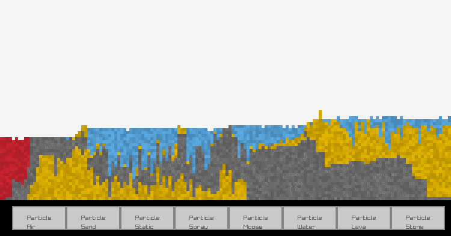
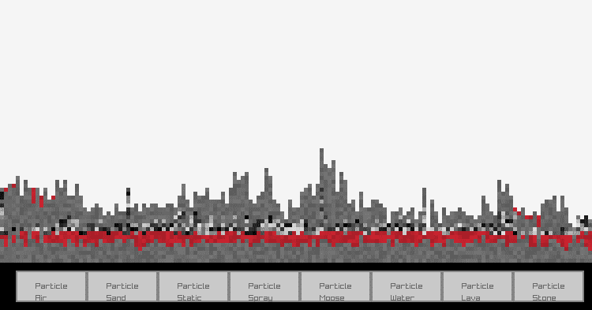
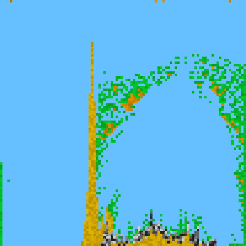
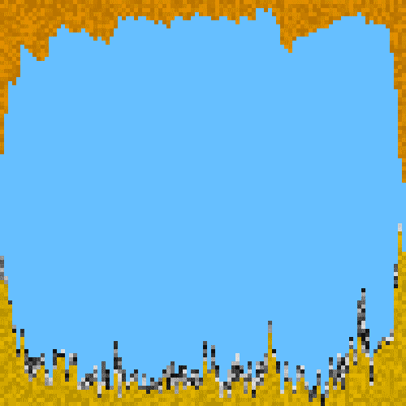

# Falling sand simulator
It's a cute little falling sand. It's got sand, stone, water, lava, orange gas, and two other glitched out particles I kept for fun

Interactions happen when two particles are adjacent to each other. Sand displaces water, lava melts sand into more lava, and water turns lava into stone.

There's also some weird particles I got while developing, and I thought they looked nice. This is also due to the relative ease of implementing particles, since all it takes is writing a processing and a creation function then appending these functions to a list

